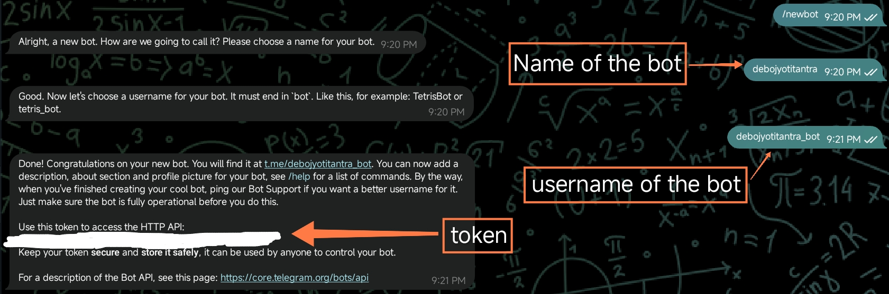

# Text-to-Speech Telegram Bot

This is a simple yet powerful Telegram bot that converts text messages into speech audio files. It's built with Python using the `python-telegram-bot` library for interacting with the Telegram API and `gTTS` for text-to-speech conversion.

## Features

- **Text-to-Speech Conversion**: Converts any text message into a high-quality audio file.
- **User Interaction Logging**: Keeps a log of user interactions, including messages sent to the bot, for administrative purposes.
- **Easy to Use**: Simply send a message to the bot, and it will reply with the audio.
- **/start Command**: A welcoming message to guide new users.
- **Command Suggestions**: Suggests the `/start` command when the user types `/`.

## Prerequisites

Before you begin, ensure you have the following installed:

- **Python 3.8+**
- **pip** (Python package installer)

## Setup and Installation

1.  **Clone the repository**:

    ```bash
    git clone https://github.com/debojyoti-tantra/Telegram-bot-TextToSpeechGenerator.git
    cd Telegram-bot-TextToSpeechGenerator
    ```

2.  **Create a Telegram Bot**:

    - Talk to the [BotFather](https://t.me/BotFather) on Telegram to create a new bot.
    - start the bot and send it `/start`.
    - The bot will reply with a welcome message.
    - Send the bot `/newbot` and follow the instructions.
    - 
    - Choose a name for your bot.
    - Enter a username for your bot.
    - You will receive a token for your bot. Keep it safe.
    - Never share your token with anyone. Otherwise, anyone can control your bot.

3.  **Set up your bot token**:

    - Create a file named `token.txt` in the root of the project directory.
    - Paste your bot token into this file and save it.

4.  **Install the dependencies**:

    ```bash
    pip install -r requirements.txt
    ```

## How to Run the Bot

Once you have completed the setup, you can start the bot with the following command:

```bash
python bot.py
```

The bot will start polling for new messages. To stop the bot, press `Ctrl-C` in your terminal.

## How to Use the Bot

1.  **Find your bot** on Telegram using the username you chose.
2.  **Send the `/start` command** to see the welcome message.
3.  **Send any text message** to the bot.
4.  The bot will reply with an **audio file** of the text you sent.

## User Logging

This bot includes a feature to log user interactions for administrative and debugging purposes. When a user interacts with the bot, a log file is created in the `user_logs` directory.

-   **Log File**: A separate log file is created for each user, named after their unique Telegram User ID (e.g., `123456789.txt`).
-   **User Information**: The log file contains the user's ID, username, first name, and last name.
-   **Message Logging**: All messages sent by the user to the bot are logged with a timestamp.

This feature is enabled by default and helps in monitoring the bot's usage and troubleshooting any issues.
